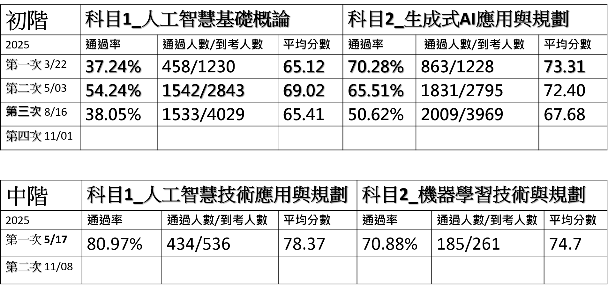

# IPAS_AI_202511
- 初階:一年考四次
  - 第一次：114/03/22(六)
  - 第二次：114/05/03(六)
  - 第三次：114/08/16(六)
  - 第四次：114/11/01(六)
- 考試科目
  - 考兩科
    - 科目一：人工智慧基礎概論（75分鐘） 
    - 科目二：生成式AI應用與規劃（75分鐘）
  - 每科目為單選題 採電腦化測驗方式填答
## 輕輕鬆鬆 游刃有餘 |必上流程
- 第一階段:三天上課
  - 聽懂==>聽到懂 ==>快速聽懂 <== 不要背!不要背!不要背!不要背!不要背!
  - 使用`注意力機制`==>畫完你的重點 
- 第二階段:完成練習 ==>把所有題庫做完(沒有答案的狀況)
  - 三天(用鉛筆寫答案) <==不要ChatGPT解
  - 可以OPEN BOOK 
- 第三階段:公布解答==>觀看解題錄影 ==> 確認自己那些部分理解不夠
  - 自己改 ==> 看看錯哪裡? ==> 為什麼會錯? 
- 第四階段:模擬考
- 第五階段:考前一周(每天看一遍教材==> 怎麼看??) ==> 每章節總結
- 第六階段:考試當天 輕輕鬆鬆 游刃有餘 考考有多高 ==> 每科目可以超過90分?
  - 沒上???? ==> 請王世堅唱國歌給你聽  https://www.youtube.com/watch?v=5f0rPpJAYI4  
## 歷次成績

## 科目1: L11 人工智慧基礎概論
  - 能掌握人工智慧的基本概念與應用領域，瞭解人工智慧的定義、基本理論和核心目標，及 AI技術在隱私、安全性與倫理層面可能面臨的挑戰。
  - 具備基本的資料處理知識，包括資料收集、清洗、分析和視覺化等過程，並能夠理解資料在 AI模型中扮演的角色與作用 。
  - 理解機器學習的基本原理及其在 AI中的作用，並熟悉常見的機器學習方法及其應用。
  - 能夠區分鑑別式 AI和生成式 AI的特性，並理解生成式 AI的概念 、 基本原理及其相關應用。
  - L111 人工智慧概念
    - L11101 AI的定義與分類
    - L11102 AI治理概念
  - L112資料處理與分析概念
    - L11201 資料基本概念與來源
    - L11202 資料整理與分析流程
    - L11203 資料隱私與安全
  - L113 機器學習概念
    - L11301 機器學習基本原理
    - L11302 常見的機器學習模型
  - L114 鑑別式 AI與生成式 AI概念
    - L11401 鑑別式 AI與生成式 AI的基本原理
    - L11402 鑑別式 AI與生成式 AI的整合應用
## 科目2:L12 生成式 AI 應用與規劃
- L121 No code / Low code概念
  - L12101 No Code / Low Code的基本概念
  - L12102 No Code / Low Code的優勢與限制
- L122 生成式 AI應用領域與工具使用
  - L12201 生成式 AI應用領域與常見工具
  - L12202 如何善用生成式 AI工具
- L123 生成式 AI導入評估規劃
  - L12301 生成式 AI導入評估
  - L12302 生成式 AI導入規劃
  - L12303 生成式 AI風險管理
