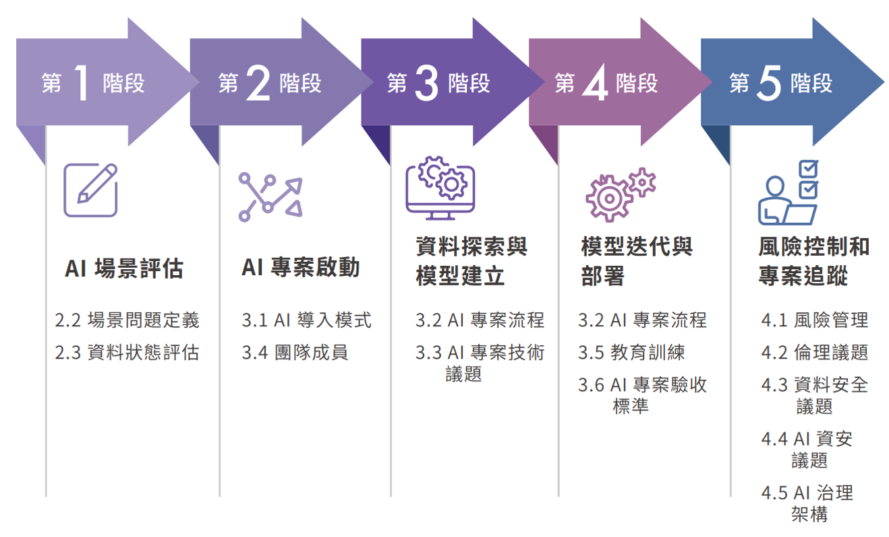

# B3_生成式 AI導入評估規劃
- L12301 生成式 AI導入評估
- L12302 生成式 AI導入規劃
- L12303 生成式 AI風險管理

## (生成式)AI導入(Adoption)的挑戰課題<== AI治理關注主題的`反面`
- AI投資 vs  AI 泡沫??
  - 主權 AI(Sovereign AI)
  - [GenAI Divide: State of AI in Business 2025](https://mlq.ai/media/quarterly_decks/v0.1_State_of_AI_in_Business_2025_Report.pdf)
    - 2025 年 MIT Media Lab 下所屬的 Project NANDA 發佈
    - 核心發現
      - 儘管企業在生成式 AI(GenAI)上的投入龐大(約 300-400 億美元)，95% 的企業沒有看到明顯的財務回報。
      - 僅有 5% 的 AI 試點最終成功落地、對利潤與營運造成可衡量影響，這個極端的分化現象即被報告稱為 “GenAI Divide”
- AI Hallucination(幻覺)
- Shadow AI| 影子 AI
- [IBM | 五大挑戰課題](https://www.ibm.com/think/insights/ai-adoption-challenges)
- 資安主題 cybersecurity OF AI | 導入AI的資安風險議題
  - OWASP Foundation |OWASP大型語言模型及生成式 AI 十大風險（2025)
    - [OWASP Top 10 for Large Language Model Applications](https://owasp.org/www-project-top-10-for-large-language-model-applications/)
  - [MITRE ATLAS(Adversarial Threat Landscape for Artificial-Intelligence Systems)](https://atlas.mitre.org/)
    - ATLAS是一個全球可存取的活生生的知識庫，根據現實世界的攻擊觀察以及人工智慧紅隊和安全小組的真實演示，介紹了針對 Al 系統的對手戰術和技術。 
  - [歐盟 ENISA網路安全局| 《Cybersecurity of AI and Standardisation》]()
    - 2023年3月的報告:深入探討了人工智慧系統在網路安全方面的標準化現況與挑戰
    - 安全觀點：不僅包括傳統的「機密性、完整性、可用性」（CIA），也要納入「AI可信度」的概念，如可解釋性、透明性、魯棒性等。

## L12301 生成式 AI導入`評估(Assessment)`
- 在 AI 導入前/導入中，用來評估組織能力、需求、風險與價值 的流程，幫助企業決定如何規劃與落地 AI
- 目的
- `評估(Assessment)`面向 1,2,.... ==> AI 導入評估檢核表 1,2,....
- 常見 AI Adoption Assessment 框架|工具|方法
  - 成熟度模型 (Maturity Models)
    - Gartner AI Maturity Model：分 Awareness → Transformational 五階段。
    - Forrester AI Readiness Model：關注企業數位成熟度。
    - IDC AI 成熟度模型
  - 顧問公司框架
    - Deloitte AI Adoption Roadmap：探索 → 準備 → 試點 → 工業化 → 擴展。
    - PwC AI Readiness Index：從資料、技術、人才、治理四面向評估。
  - 治理導向框架
    - NIST AI RMF：Govern → Map → Measure → Manage。
    - ISO 42001:2023
    - OECD AI Principles：可信任 AI 的五大原則
  - 常用方法
    - 問卷與指標評估：透過內部調查評分企業在數據、技術、人員上的成熟度。
    - 差距分析(Gap Analysis)：比較「現況 vs. 目標」，找出差距並制定改進方案。
    - 試點專案(Pilot Projects)：先做小規模 PoC，作為導入前的驗證
  - 三大公有雲
    - 谷歌 [Google Cloud AI Adoption Framework](https://cloud.google.com/resources/cloud-ai-adoption-framework-whitepaper?hl=zh-TW)
    - 亞馬遜 AWS Cloud Adoption Framework for Artificial Intelligence, Machine Learning, and Generative AI
      - https://docs.aws.amazon.com/whitepapers/latest/aws-caf-for-ai/aws-caf-for-ai.html 
    - 微軟 | [Cloud Adoption Framework (CAF)](https://learn.microsoft.com/en-us/azure/cloud-adoption-framework/
- 典型流程(不同機關有不同的做法)
- 導入`評估(Assessment)`產出成果(不同機關有不同的做法)
  - AI Readiness Score / Maturity Level(組織的 AI 成熟度)
  - AI Adoption Roadmap(導入時間表與優先順序)
  - AI 路線圖：短期（PoC）、中期（多部門推廣）、長期（全面轉型）
  - 風險控管計畫（包含法規遵循與倫理原則）
  - 風險與資源建議：所需的人才培訓、技術升級與治理機制。
  - 投資需求與 ROI 分析。
## L12302 生成式 AI導入`規劃(Planning)`
- (生成式)AI 導入規劃是一個協助組織系統化、策略化地採用人工智慧技術的過程
- 目的是在降低風險與成本的前提下，最大化 (生成式) AI 的價值。

## L12303 生成式 AI`風險管理`
- 風險管理 ==> 風險評鑑(Risk Assessment)->風險處理(Risk Treatment)
- AI 風險管理:挑戰課題(Challenges for AI Risk Management)
  - NIST AI RMF提出的挑戰課題
  - `1`.風險衡量(Risk Measurement)
  - `2`.風險容忍度(Risk Tolerance)
  - `3`.風險優先順序(Risk Prioritization)
  - `4`.組織`整合`與`管理`風險(Organizational Integration and Management of Risk)
- AI風險管理
  - ISO/IEC 23894:2023 人工智慧 風險管理 指南 Information technology — Artificial intelligence — Guidance on risk management
  - NIST AI RMF(人工智慧 風險管理框架):
    - AI RMF 核心(Core) vs AI RMF Profile(設定檔)
    - 核心(Core) ==>治理(Govern) 映射(Map) 衡量(Measure) 管理(Manage)
- 人工智慧風險與傳統軟體風險有何不同?
- 生成式 AI風險管理
  - NIST AI RMF:Generative Artificial Intelligence Profile
  - 生成式 AI 的 12 大獨有的風險及建議作法

## `AI 導入(AI Adoption)`的生命週期流程
- 參考[數位發展部《公部門人工智慧應用參考手冊（草案）》](https://moda.gov.tw/digital-affairs/digital-service/guide/15002)
- 人工智慧導入（AI Adoption）指的是組織從策略構想到落地應用的全過程，  涵蓋策略規劃、資料準備、模型研發、部署整合、監控維運與價值擴散等階段。
- 目的:不僅是技術落地，更強調「責任式 AI（Responsible AI）」、  「風險治理（AI Governance）」與「組織變革（Organizational Transformation）」的協調發展。

- 🤖 主要AI 導入（AI Adoption）生命週期流程主要框架比較(AI Adoption Lifecycle Frameworks)

| 類別 | 框架名稱 | 主導機構 / 來源 | 主要特色 | 適用場域 |
|------|------------|------------------|-----------|------------|
| 🧭 治理導向 | **NIST AI Risk Management Framework (AI RMF)** | 美國國家標準與技術研究院（NIST, 2023） | 定義 AI 系統生命週期四大功能：**Govern, Map, Measure, Manage**，聚焦於風險識別、衡量與治理 | 公部門、企業治理、AI 風險管理 |
| 📈 成熟度導向 | **Gartner AI Maturity Model** | Gartner | 將 AI 導入分為五階段：**Awareness → Active → Operational → Systematic → Transformational**，對應組織文化與技術能力 | 企業 AI 導入策略與評估 |
| 🏗️ 管理系統導向 | **ISO/IEC 42001:2023 – AI Management System (AIMS)** | 國際標準化組織（ISO） | 建立「AI 管理系統」標準，涵蓋政策、風險控制、稽核、持續改進 | 國際認證、法規遵循 |
| ⚙️ 技術實踐導向 | **[CRISP-ML(Q) – Cross-Industry Process for Machine Learning (Quality)](https://ml-ops.org/content/crisp-ml)** | 德國研究團隊（延伸自 CRISP-DM） | 以 ML 導入流程為中心：**Business Understanding → Data Understanding → Modeling → Deployment → Quality Assurance** | 資料科學與機器學習專案 |

- 還有很多框架
- [PwC AI Lifecycle Framework](https://www.mckinsey.com/capabilities/mckinsey-digital/our-insights/a-data-leaders-operating-guide-to-scaling-gen-ai)
- [AI Adoption & Scaling Framework (McKinsey)](https://www.mckinsey.com/capabilities/mckinsey-digital/our-insights/a-data-leaders-operating-guide-to-scaling-gen-ai)
- Deloitte [Strategic AI governance roadmap](https://www.deloitte.com/us/en/programs/center-for-board-effectiveness/articles/board-of-directors-governance-framework-artificial-intelligence.html)
  - Deloitte’s Governance Framework
  - 哈佛法學院公司治理論壇 [Strategic Governance of AI: A Roadmap for the Future](https://corpgov.law.harvard.edu/2025/04/24/strategic-governance-of-ai-a-roadmap-for-the-future/)
