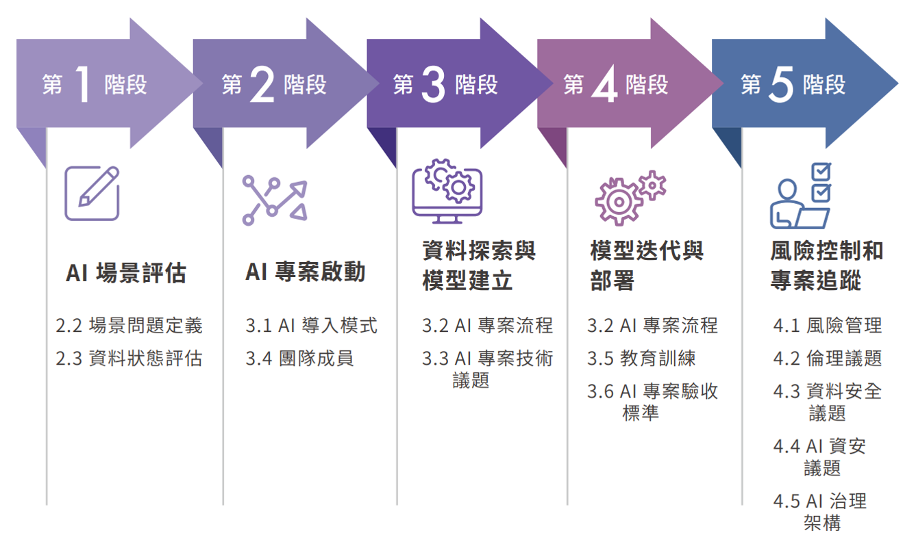

## `AI 導入(AI Adoption)`的生命週期流程
- 參考[數位發展部《公部門人工智慧應用參考手冊（草案）》](https://moda.gov.tw/digital-affairs/digital-service/guide/15002)
- 人工智慧導入（AI Adoption）指的是組織從策略構想到落地應用的全過程，  涵蓋策略規劃、資料準備、模型研發、部署整合、監控維運與價值擴散等階段。
- 目的:不僅是技術落地，更強調「責任式 AI（Responsible AI）」、  「風險治理（AI Governance）」與「組織變革（Organizational Transformation）」的協調發展。

- 🤖 主要AI 導入（AI Adoption）生命週期流程主要框架比較(AI Adoption Lifecycle Frameworks)

| 類別 | 框架名稱 | 主導機構 / 來源 | 主要特色 | 適用場域 |
|------|------------|------------------|-----------|------------|
| 🧭 治理導向 | **NIST AI Risk Management Framework (AI RMF)** | 美國國家標準與技術研究院（NIST, 2023） | 定義 AI 系統生命週期四大功能：**Govern, Map, Measure, Manage**，聚焦於風險識別、衡量與治理 | 公部門、企業治理、AI 風險管理 |
| 📈 成熟度導向 | **Gartner AI Maturity Model** | Gartner | 將 AI 導入分為五階段：**Awareness → Active → Operational → Systematic → Transformational**，對應組織文化與技術能力 | 企業 AI 導入策略與評估 |
| 🏗️ 管理系統導向 | **ISO/IEC 42001:2023 – AI Management System (AIMS)** | 國際標準化組織（ISO） | 建立「AI 管理系統」標準，涵蓋政策、風險控制、稽核、持續改進 | 國際認證、法規遵循 |
| ⚙️ 技術實踐導向 | **[CRISP-ML(Q) – Cross-Industry Process for Machine Learning (Quality)](https://ml-ops.org/content/crisp-ml)** | 德國研究團隊（延伸自 CRISP-DM） | 以 ML 導入流程為中心：**Business Understanding → Data Understanding → Modeling → Deployment → Quality Assurance** | 資料科學與機器學習專案 |

- 還有很多框架
- [PwC AI Lifecycle Framework](https://www.mckinsey.com/capabilities/mckinsey-digital/our-insights/a-data-leaders-operating-guide-to-scaling-gen-ai)
- [AI Adoption & Scaling Framework (McKinsey)](https://www.mckinsey.com/capabilities/mckinsey-digital/our-insights/a-data-leaders-operating-guide-to-scaling-gen-ai)
- Deloitte [Strategic AI governance roadmap](https://www.deloitte.com/us/en/programs/center-for-board-effectiveness/articles/board-of-directors-governance-framework-artificial-intelligence.html)
  - Deloitte’s Governance Framework
  - 哈佛法學院公司治理論壇 [Strategic Governance of AI: A Roadmap for the Future](https://corpgov.law.harvard.edu/2025/04/24/strategic-governance-of-ai-a-roadmap-for-the-future/)
